CLiCTagger Region-tagging
*************************

Python module to identify regions in text.

|ci| |gh-pages|

.. |ci| image:: https://github.com/mahlberg-lab/clictagger/actions/workflows/ci.yml/badge.svg
.. |gh-pages| image:: https://github.com/mahlberg-lab/clictagger/actions/workflows/gh-pages.yml/badge.svg

Part of the `CLiC project <https://www.birmingham.ac.uk/schools/edacs/departments/englishlanguage/research/projects/clic/index.aspx>`__

Installation
============

Linux
-----

First make sure you have the following prerequisites installed::

    apt-get install python3 python3-dev \
        libicu-dev pkg-config

Then install via. pip::

    pip install clictagger

Windows / MacOS
---------------

Under either you can install clictagger via. `Anaconda <https://docs.conda.io/projects/conda/en/latest/user-guide/index.html>`__:

1. Install `Miniconda <https://docs.conda.io/en/latest/miniconda.html>`__ if you haven't already.
2. Download `environment-windows.yml <https://github.com/mahlberg-lab/clictagger/raw/HEAD/environment-windows.yml>`__
   if running windows, `environment.yml <https://github.com/mahlberg-lab/clictagger/raw/HEAD/environment.yml>`__ otherwise.
3. Start an `Anaconda prompt <https://docs.conda.io/projects/conda/en/latest/user-guide/getting-started.html>`__
4. On windows, run ``conda env create -f environment-windows.yml``, otherwise run ``conda env create -f environment.yml``
5. ``conda activate clictagger``

You can now use ``clictagger``.

Usage
=====

Python notebook
---------------

See `getting_started.ipynb <https://mybinder.org/v2/gh/mahlberg-lab/clictagger/HEAD?filepath=getting_started.ipynb>`__.

To region-tag your own examples, use `file-upload.ipynb <https://mybinder.org/v2/gh/mahlberg-lab/clictagger/HEAD?filepath=file-upload.ipynb>`__

Command line
------------

You should now have the ``clictagger`` command available. See ``--help`` for usage.

For more examples, see the `clictagger.script <https://mahlberg-lab.github.io/clictagger/clictagger.script>`__ documentation.

Development
===========

There is a Makefile that will setup and perform common development actions, in
a venv. Once code is checked out you can run::

    make test  # Run all tests
    make lint  # Check code formatting
    make coverage  # Check unit-test coverage
    make notebook  # Install and serve a Jupyter notebook session
    make release  # Use zest.releaser to make a new release

Acknowledgements
================

This work is released under `MIT <LICENSE>`__.
